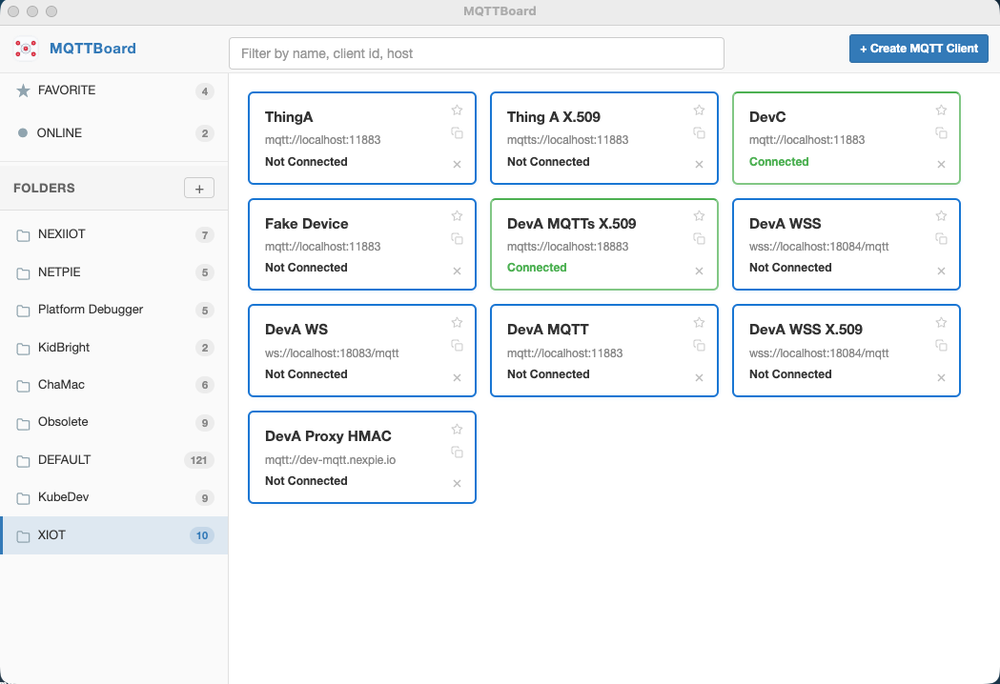
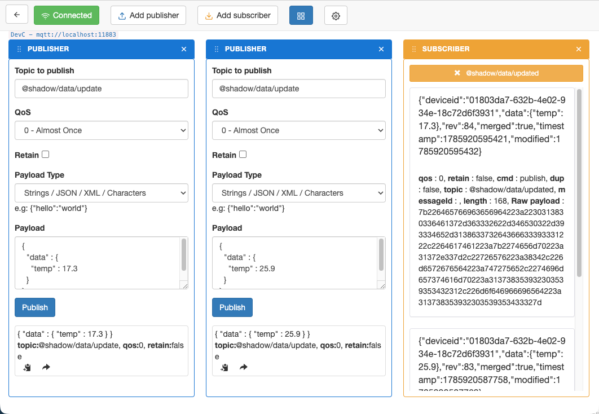

# MQTTBoard

MQTTBoard is an open-source desktop MQTT client for inspecting, testing, and organizing MQTT connections.

It is designed for developers and operators who need a lightweight GUI to:
- connect to MQTT brokers over TCP or WebSocket
- publish and subscribe to topics
- manage multiple client profiles
- organize clients into folders
- review message history
- run MQTT load tests

## Features

### MQTT client
- Multiple MQTT client profiles
- TCP, TLS, WebSocket, and Secure WebSocket connection modes
- Publish and subscribe workflows
- Topic wildcard support with `+` and `#`
- Message history per client/topic flow
- Favorite and online views
- Import/export config as JSON

### Organization
- Folder-based client grouping
- Drag-and-drop client ordering
- Saved filters and protocol filter state

### Load testing
- MQTT publish/subscribe load test flows
- Basic data and graph views for load test results

## Screenshots

### Client workspace



### Publish and subscribe dashboard



## Install

The easiest way to use MQTTBoard is to download a packaged desktop build from the repository Releases page:

- macOS Intel
- macOS Apple Silicon
- Windows x64
- Linux x64

If you prefer to build it yourself, follow the source build steps below.

## Build From Source

### Requirements
- Node.js
- npm
- macOS, Windows, or Linux

This project currently depends on an older `mqtt` package version. If you build the web-facing assets and hit the legacy host-detection issue, apply the patch described in the Development Notes section below.

### 1. Clone the repository

- `git clone https://github.com/chavee/mqttboard.git`
- `cd mqttboard`

### 2. Install dependencies

- `npm install`

### 3. Build and run the desktop app

- `npm run desktop`

This builds the app assets and launches MQTTBoard with Electron.

### 4. Build distributable packages

- `npm run build:desktop`

This produces platform-specific installer output in `dist/` for the current OS:
- macOS: `.dmg`
- Windows: `.exe`
- Linux: `.AppImage`

### 5. Build web assets only

- `npm run build:web`

This generates compiled frontend assets in `build/`.

## Development Notes

### Legacy `mqtt` workaround

This repository uses `mqtt@2.1.1`. In some environments, that version may require a small manual patch for browser/webworker builds.

Open:
- `node_modules/mqtt/lib/connect/ws.js`

Find and remove this block:

```js
else {
    throw new Error('Could not determine host. Specify host manually.')
}
```

This workaround is only relevant if you hit that specific legacy issue while building or running the web-facing assets.

### Config import/export

In the desktop app:
- `File -> Export Config JSON` saves `clients`, `loads`, and `folders`
- `File -> Import Config JSON` restores a previously exported config

## Project Status

MQTTBoard is actively maintained as a practical utility project. The codebase includes older dependencies and legacy patterns, but the app is being updated incrementally with better desktop packaging and usability improvements.

## Contributing

Issues and pull requests are welcome.

If you report a bug, include:
- your OS and version
- how you installed or built MQTTBoard
- steps to reproduce
- logs or screenshots if relevant

## License

MIT
